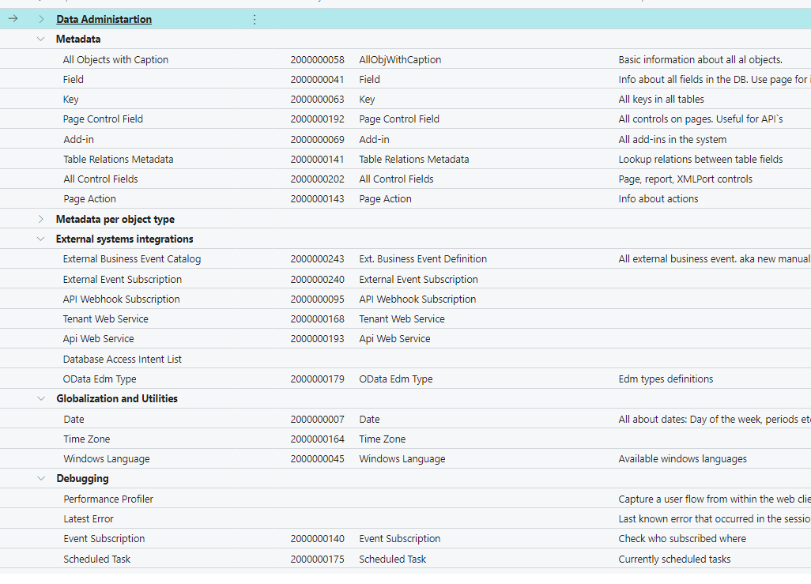
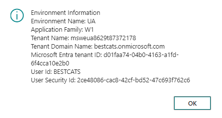
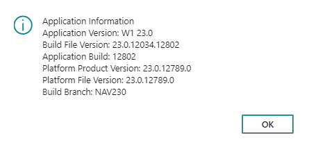

# Business Central System Table Navigator

## Overview

The Business Central System Table Navigator is an open-source tool designed to simplify and streamline the process of navigating and interacting with system tables within Microsoft Dynamics 365 Business Central. It provides a convenient and efficient way to access essential data stored in system tables, making it a valuable asset for developers, testers, administrators, and business analysts working with BC.

## Key Features

- **Intuitive Table Selection:** Easily select and browse through various system tables within your Business Central instance. The tool provides a user-friendly interface with tables sorted into categories.

- **Export Functionality:** Export data from some tables to Excel.

- **System Information Codeunits:** Data about environment and application

## Getting Started

Grab the app and puplish. You will find all the functionality on the page "System Tables".
- Main table list

- Environment info (as an action)

- Application info (as an action)

## Contributing

Please, feel free to open any PRs.

## License

This open-source project is released under the [MIT License](LICENSE), ensuring that you have the freedom to use, modify, and distribute it as per your requirements.

## Support

If you encounter any issues, have questions, or would like to suggest improvements, please create an [issue](https://github.com/mundanebcdev/System-Table-Navigator/issues) on this repository.
